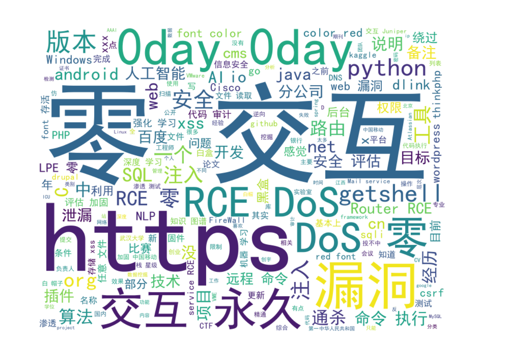
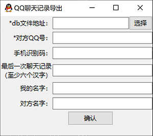

# Last Dance
## ALL in One
### 今年漏洞统计
|漏洞类型|数量|售出|到账|
|--|--|--|--|
|web|73|/|/|
|iot|81|/|/|
|other|16|/|/|

### 项目统计
- 深度学习 + 强化学习 才是未来
- 基于专家系统和强化学习的 iot/二进制 漏洞自动化挖掘（..很牵强的 生成exp也是多问题，基本上需要人为微调）
- DL-Payload-Generate（其实效果不是很好..）
- 漏洞固件仿真平台
- 洪武武器库
- 团队协作平台（尽管完成但没有团队...）
- 洪武漏洞库（可以理解为kunpeng的二次开发，改动有点大）
- AutoFeature （基于自己漏洞挖掘习惯和既有0day训练的特征工程框架）
- PARL-RE（基于paddlepaddle的强化学习自己实现和改良的算法，我觉得原版不咋行.. ）

### 比较满意的0day：

[部分简介](http://evilxyz.xyz/index.php/5.html)  
- Edge 87.0.664 RCE
- Drupal 
- BLE RCE
- Huawei route 
- Dlink 

### 参加比赛：（多为枪手..）
- 一堆CTF
- ACM（附带一篇论文）
- AI的比赛很多都没拿到奖，太忙了只能提交一次baseline，只拿到一个三万块的二等奖

### 今年阅读书籍：
- 《船山遗书》读至第三册 诗经部分
- 《重来3》已读完
- 《哲学史》十六册全 已读完 ::论文于wh大学学报人文科学版 
- 《黑金系列:人性论》已读完
- 《黑金系列:论法的精神》已读完
- 《黑金系列:中国人的脸谱》已读完
- 《胡乔木回忆毛泽东》已读完
- 《经济学的思维方式》已读完 ::论文于财大学报
- 《What Life Should Means to You》尚未读完 书已赠人
- 《海错图笔记》1 尚未读完
- 《病理学》《病理生理学》病理学读至第八章遗传病章节 病理生理读至水电解质章节
- 《尸体变化图鉴》已读完
- 《实用人体解剖图谱》四肢部分 尚未读完
- 《现代量子力学》读至角动量理论 
- 《黑客大揭秘 近源渗透测试》已读完
- 《深度学习与飞浆paddlepaddle fluid实战》已读完
- 《CTF特训营》 匆忙过一遍
- 《Manning Deep Reinforcement Learning in Action》读至8.6  Intrinsic curiosity module 
- 《Reinforcement Learning: State-of-the-Art》读至Rmax泛化
- paper（不限于ai security PhD）约有112篇 只统计打印成纸的和ipad内的（我远远做不到每天阅读复现一篇论文）
- paper 2/7 


### 词云效果
综合 词云
  

0day 词云

  

社交工具 词云
  


## PLAN
一年又过去了，其实按照计划定制的时间，应该在21年4月8日才算是完成一年计划，奈何今年在九月底就完成今年的计划，也是在九月底就半停止漏洞挖掘和相关的代码工作了。所以在2020年12月31日做个总结也还行吧。只有两个小时码字和写代码并实现下面的功能，有点匆忙别在意。

## WordCloud

恍恍惚惚，很多人不知道自己在一年内干了啥，其实有个还不错的办法就是使用统计和词云（统计词语频率），如果没做日志或者周报的话，聊天记录也算是不错的选择，我这里就演示下，暂时不讨论tg aw等特殊聊天工具，仅讨论扣扣和weixin。微博 小红书同理可得txt。  


对一年的挖掘的漏洞也可以进行统计，得到0day.txt（里面是以行划分的payloads和sink，可分为web和二进制）//如果你0day数量太少，也没必要操作这个.  
但是这部分有点麻烦，毕竟要做一个安全专用的分词工具，或者说数据预处理工具，还是有点麻烦的。暂时先加入未经处理的payload和sink 构成0day.txt

## Export TXT

将聊天记录导出成txt。

> 微信 https://github.com/forest0/wechat_history_export
> 扣扣 https://github.com/Yiyiyimu/QQ_History_Backup

方法我就放在后面吧。 

使用方法：[WeChat](https://github.com/forest0/wechat_history_export)  

使用方法:[QQ](https://github.com/Yiyiyimu/QQ_History_Backup)  


微信聊天记录导出为csv。

**目前仅在macOS上测试了**，不确定其它平台的聊天记录也在AES加密的sqlite3数据库中，
如果一样的话应该也可以使用这个方法，欢迎PR。

### demo

提供了一个demo，在`demo.py`，
这**不是开箱即用**的脚本，你可能需要自己动手。

或许后续你可以使用[pysqlcipher](https://github.com/leapcode/pysqlcipher)。

### 一些信息

假设微信信息存放在目录`wechat_root=~/Library/Containers/com.tencent.xinWeChat/Data/Library/Application Support/com.tencent.xinWeChat/xxx_version/xxx`下的相关AES加密的sqlite3数据库文件中：

- 联系人: `wechat_root/Contanct/wccontact_new2.db`
- 群聊: `wechat_root/Group/group_new.db`
- 聊天记录: `wechat_root/Message/msg_xxx.db`

想办法解密数据库文件就可以获取到想要的信息了。

### 依赖

- [sqlcipher](https://github.com/sqlcipher/sqlcipher)

### AES Key 获取

#### macOS

- 打开微信客户端, **先不要登录**
- `lldb -p $(pgrep WeChat)`
    - `br set -n sqlite3_key`
    - `continue`
- 登录
- 返回lldb `memory read --size 1 --format x --count 32 $rsi`
- 上边打印的即为256-bit的aes key

你会看到类似如下的输出
```
0x60000243xxxx: 0xe8 0x8d 0x4a 0xd0 0x82 0x6a 0xe2 0x8f
0x60000243xxxx: 0x77 0x70 0x54 0xd4 0x8e 0x72 0x3a 0x1b
0x60000243xxxx: 0x0a 0xe7 0x9c 0x89 0x5f 0x49 0xb0 0xec
0x60000243xxxx: 0x79 0xdf 0x2a 0x68 0xd5 0x9c 0xb8 0xf5
```

则在 `demo.py` 中将 `wechat_raw_key` 赋值为
`'e88d4ad0826ae28f777054d48e723a1b0ae79c895f49b0ec79df2a68d59cb8f5'`。

#### 其它

网上应该能找到一些其它的方法，如果你试了可以work，欢迎PR。

### 数据库文件解密

```sh
# open encrypted database by sqlcipher
sqlcipher wccontact_new2.db

# set decryption parameter in sqlcipher
PRAGMA key = "x'your_aes_key_here'";
PRAGMA cipher_page_size = 1024;
PRAGMA kdf_iter = '64000';
PRAGMA cipher_kdf_algorithm = PBKDF2_HMAC_SHA1;
PRAGMA cipher_hmac_algorithm = HMAC_SHA1;

# check decryption succeed or not
SELECT COUNT(*) FROM sqlite_master;

# dump decrypted database to xxx_dec.db
ATTACH DATABASE 'xxx_dec.db' AS plaintext KEY '';
SELECT sqlcipher_export('plaintext');
DETACH DATABASE plaintext;
```

### Write Ahead Log合并

使用上边的方式导出解密后的数据库，可能有些最新的数据不在数据库中，
后来发现微信启用了[wal](https://www.sqlite.org/wal.html)，
可以通过checkpoint合并，以`msg_0.db`为例：

```sh
mkdir wd
cp msg_0.db msg_0.db-shm msg_0.db-wal wd/
cd wd

# open encrypted database by sqlcipher
sqlcipher msg_0.db

# set decryption parameter in sqlcipher
PRAGMA key = "x'your_aes_key_here'";
PRAGMA cipher_page_size = 1024;
PRAGMA kdf_iter = '64000';
PRAGMA cipher_kdf_algorithm = PBKDF2_HMAC_SHA1;
PRAGMA cipher_hmac_algorithm = HMAC_SHA1;

# check decryption succeed or not
# SELECT COUNT(*) FROM sqlite_master;

# merge wal
PRAGMA wal_checkpoint;

# dump decrypted database to xxx_dec.db
ATTACH DATABASE 'xxx_dec.db' AS plaintext KEY '';
SELECT sqlcipher_export('plaintext');
DETACH DATABASE plaintext;
```

qq

### 获取db文件方法

如果root了，直接在以下地址就可以找到  

```
data\data\com.tencent.mobileqq\databases\你的QQ.db 和 slowtable_你的QQ.db  
```


如果没有root，可以通过手机自带的备份工具备份整个QQ软件，具体方法可以参见  

> 怎样导出手机中的QQ聊天记录？ - 益新软件的回答 - 知乎
> https://www.zhihu.com/question/28574047/answer/964813560  

导出之前建议发给对方一句话（至少六个汉字），后面解密用  

### GUI使用方法

  


db文件地址（必填）：选择对应的 qq号.db ，如果不全再选择slowtable_qq号.db  

对方QQ号（必填）  
  
手机识别码（待自动填入，供slowtable使用）：  
Android Q及以上（19年以后的系统）限制了id获取权限，无法使用手机识别码（IMEI/MEID）作为聊天记录数据库的密钥，只能通过最后一次聊天记录计算key。在导出slowtable里的内容时默认使用前一步输出的手机识别码作为密钥。  

最后一次聊天记录（非slowtable**必填**）：  
因为测试所用两部手机密钥分别为9位和14位，一个汉字对应三个utf-8码，为了避免更长的密钥推荐使用至少六个汉字符号。可以在导出之前给对方发一句话过去。  

我的名字（选填）：默认为“我”，填入进行替换  

对方名字（选填）：默认为对方QQ号，填入进行替换  

## DATA  
- qq.txt
- wx.txt
- 0day.txt
  

## 分词和停用词

这里时间不多了，就简单用一些简单的分词，后续替换更好用就行了。比如jieba。  
停用词的话，正常聊天的数据 用cn_stopwords.txt即可。payload这些的需要安全专用的分词和数据预处理的工具，我写了个demo而已。  

对于人名需要去重的，可以直接导出通讯录加入停用词即可。   
一些特殊的 不想删除的停用词也可以从中移除，比如“唉”    

## 画图
pip安装一下  
Pillow，numpy，matplotlib


|属性名|示例|说明|
|---|---|---|
|background_color|	background_color='white'|	指定背景色,可以使用16进制颜色
|width|	width=600|	图像长度默认400 单位像素
|height|	height=400|	图像高度 默认200
|margin|	margin=20|	词与词之间的边距 默认2
|scale|	scale=0.5|	缩放比例 对图像整体进行缩放 默认为1
|prefer_horizontal|	prefer_horizontal=0.9|	词在水平方向上出现的频率,默认为0.9
|min_font_size|	min_font_size=10|	最小字体 默认为4
|max_font_size|	max_font_size=20|	最大字体 默认为200
|font_step|	font_step=2	|字体步幅 控制在给定text遍历单词的步幅 默认为1 一般不用修改 对于较大text 增大font_step会加快读取速度 但会牺牲部分准确性
|stopwords|	stopwords=set('dog')|	设置要过滤的词 以字符串或者集合作为接收参数 如不设置将使用默认的 停动词词库
|mode|	mode='RGB'|	设置显色模式 默认RGB 如果为RGBA且|background_color不为空时，背景为透明
|relative_scaling|	relative_scaling=1|	词频与字体大小关联性 默认为5 值越小 变化越明显
|color_func|	color_func=None|	生成新颜色的函数 如果为空 则使用 self.color_func
|regexp|	regexp=None|	默认单词是以空格分割,如果设置这个参数 将根据指定函数来分割
|width|	regexp=None|	默认400 单位像素
|collocations|	collocations=False|	是否包含两个词的搭配 默认为True
|colormap|	colormap=None|	给所有单词随机分配颜色 指定color_func则忽略
|random_state|	random_state=1|	为每个单词返回一个PIL颜色
|font_path|	font_path='PangMenZhengDaoBiaoTiTi-1.ttf'|	指定字体
|mask|	mask=None|	指定背景图,会将单词填充在背景图像素非白色(#FFFFFF RGB(255,255,255))的地方


基本上有手就行  
自己看代码即可

## 你需要做的

`git clone https://github.com/lazybootsafe/LastDance.git`
处理好相应txt 放入目录下  
如qq.txt wx.txt 0day.txt 等等  

`python3 -m pip -r requirements.txt`


修改demo.py把想要的注释去掉  
`python3 demo.py`